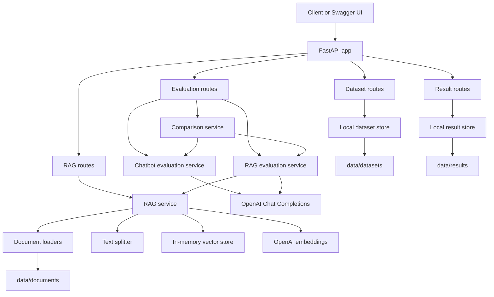
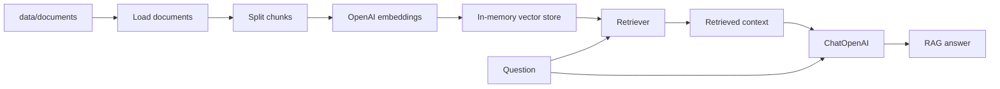
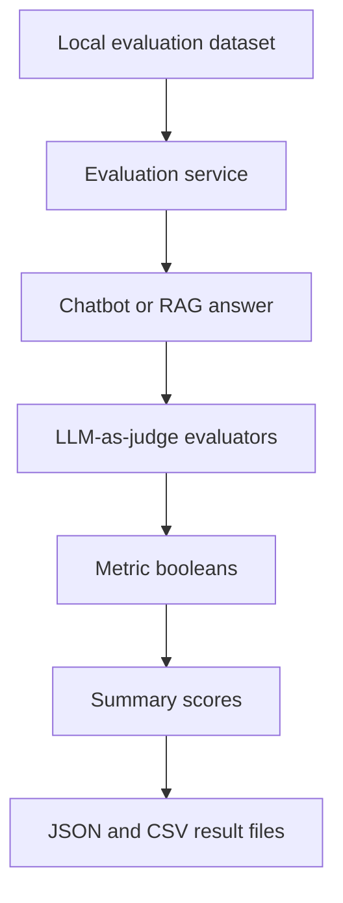

# Chatbot & RAG Evaluator API

## Project overview

This project converts a notebook-based chatbot and RAG evaluation concept into a modular FastAPI product.

It supports local dataset management, normal chatbot evaluation, RAG document ingestion, RAG query, RAG evaluation, multi-model comparison, result listing, JSON/CSV export, and pytest-based automated testing.

The working API is local-first. Datasets are stored as JSON files, documents are loaded from local folders, RAG retrieval uses an in-memory vector store, and evaluation results are saved locally under `data/results/`.

## Problem statement

Notebook experiments are useful for prototyping, but they are hard to reuse, test, and expose as production-style workflows. This project turns the evaluation notebook flow into an API that another developer can run, test, and extend.

The core problem solved here is evaluating chatbot and RAG outputs locally without depending on LangSmith dataset or evaluation APIs.

## Main features

- Local dataset CRUD API
- Normal chatbot evaluation with correctness and concision metrics
- Local RAG document ingestion from `.txt` and `.md` files
- In-memory RAG vector store using OpenAI embeddings
- RAG query API with retrieved document output
- RAG evaluation with correctness, groundedness, answer relevance, and retrieval relevance
- Multi-model comparison for chatbot and RAG flows
- JSON and CSV result export
- Result listing and retrieval API
- Swagger UI via FastAPI
- Automated tests with pytest and FastAPI TestClient

## Architecture overview



### RAG flow



### Evaluation flow



## Tech stack

- Python
- FastAPI
- Pydantic
- OpenAI Python SDK
- LangChain
- LangChain OpenAI
- LangChain text splitters
- InMemoryVectorStore
- python-dotenv
- pytest
- FastAPI TestClient

## Folder structure

```text
chatbot-evaluator/
  app.py
  requirements.txt
  .env.example
  README.md
  data/
    datasets/
      chatbot_eval_sample.json
      rag_eval_sample.json
    documents/
      rag_sample.txt
    results/
    vectorstores/
  src/
    api/
      main.py
      routes/
        datasets.py
        evaluation.py
        health.py
        rag.py
        results.py
    core/
      config.py
    llm/
      evaluators.py
      openai_client.py
    rag/
      loaders.py
      rag_chain.py
      retriever.py
      splitter.py
      vectorstore.py
    schemas/
      common.py
      datasets.py
      evaluation.py
      rag.py
      results.py
    services/
      chatbot_eval_service.py
      compare_eval_service.py
      rag_eval_service.py
      rag_service.py
    storage/
      dataset_store.py
      paths.py
      result_store.py
  tests/
```

## Environment variables

Create a `.env` file from `.env.example`:

```bash
cp .env.example .env
```

Required:

```env
OPENAI_API_KEY=your_openai_api_key_here
```

Optional defaults:

```env
DEFAULT_MODEL=gpt-4o-mini
DEFAULT_EVALUATOR_MODEL=gpt-4o-mini
DEFAULT_EMBEDDING_MODEL=text-embedding-3-small

DEFAULT_CHUNK_SIZE=500
DEFAULT_CHUNK_OVERLAP=50
DEFAULT_TOP_K=6
```

Tracing is disabled in the local-first version:

```env
LANGSMITH_TRACING=false
LANGCHAIN_TRACING_V2=false
```

## Setup with uv

Create and activate a virtual environment:

```bash
uv venv
```

Windows PowerShell:

```powershell
.\.venv\Scripts\Activate.ps1
```

Windows Git Bash:

```bash
source .venv/Scripts/activate
```

Install dependencies:

```bash
uv pip install -r requirements.txt
```

## Run FastAPI

```bash
uvicorn app:app --reload
```

The root `app.py` exposes the FastAPI app:

```python
from src.api.main import app
```

## Swagger UI

Open:

```text
http://127.0.0.1:8000/docs
```

## Dataset format

Datasets are stored in `data/datasets/` as JSON files.

Example:

```json
{
  "name": "chatbot_eval_sample",
  "examples": [
    {
      "inputs": {
        "question": "What is LangChain?"
      },
      "outputs": {
        "answer": "A framework for building LLM applications"
      }
    }
  ]
}
```

The evaluation services expect:

- `inputs.question`
- `outputs.answer`

## Chatbot evaluation flow

Endpoint:

```text
POST /evaluate/chatbot
```

Flow:

```text
dataset question
  -> chatbot model response
  -> correctness evaluator
  -> concision evaluator
  -> result rows
  -> summary scores
  -> optional JSON/CSV save
```

Metrics:

- `correctness`: LLM-as-judge semantic match against the reference answer
- `concision`: local word-count threshold check

## RAG ingestion flow

Endpoint:

```text
POST /rag/ingest
```

Flow:

```text
data/documents
  -> load .txt/.md documents
  -> split into chunks
  -> create OpenAI embeddings
  -> build in-memory vector store
```

The current MVP vector store is in-memory only. After restarting FastAPI, call `/rag/ingest` again.

## RAG query flow

Endpoint:

```text
POST /rag/query
```

Flow:

```text
question
  -> retriever
  -> retrieved documents
  -> ChatOpenAI answer with context
  -> answer + retrieved document metadata
```

## RAG evaluation flow

Endpoint:

```text
POST /evaluate/rag
```

Required call order:

```text
1. POST /rag/ingest
2. POST /evaluate/rag
```

Metrics:

- `correctness`: RAG answer matches reference answer
- `groundedness`: answer is supported by retrieved documents
- `relevance`: answer directly addresses the question
- `retrieval_relevance`: retrieved documents are relevant to the question

## Multi-model comparison flow

Endpoint:

```text
POST /evaluate/compare
```

Supported modes:

- `chatbot`
- `rag`

For chatbot mode, the API runs normal chatbot evaluation for every model.

For RAG mode, the API runs RAG evaluation for every model. Call `/rag/ingest` first.

## Result storage and export

Results are stored under:

```text
data/results/
```

When `save_result=true`, evaluation endpoints save:

- JSON result file
- CSV detail rows where possible

Result APIs:

```text
GET /results
GET /results/{result_file_name}
```

JSON files are returned as parsed JSON. CSV files are returned as JSON row lists.

Saved result payloads include:

```json
{
  "mode": "rag",
  "dataset_name": "rag_eval_sample",
  "model_name": "gpt-4o-mini",
  "evaluator_model": "gpt-4o-mini",
  "created_at": "2026-05-19T00:00:00Z",
  "summary": {},
  "results": [],
  "saved_result_path": "data/results/example.json",
  "saved_csv_path": "data/results/example.csv"
}
```

## API endpoint reference

| Method | Endpoint | Purpose |
|---|---|---|
| GET | `/health` | Health check |
| GET | `/datasets` | List datasets |
| POST | `/datasets` | Create dataset |
| GET | `/datasets/{name}` | Get dataset |
| POST | `/evaluate/chatbot` | Run normal chatbot evaluation |
| POST | `/rag/ingest` | Load documents and build in-memory vector store |
| POST | `/rag/query` | Query RAG system |
| POST | `/evaluate/rag` | Run RAG evaluation |
| POST | `/evaluate/compare` | Compare multiple models |
| GET | `/results` | List saved result files |
| GET | `/results/{result_file_name}` | Read saved result file |

## Example curl commands

Health:

```bash
curl http://127.0.0.1:8000/health
```

List datasets:

```bash
curl http://127.0.0.1:8000/datasets
```

Chatbot evaluation:

```bash
curl -X POST "http://127.0.0.1:8000/evaluate/chatbot" \
  -H "Content-Type: application/json" \
  -d '{
    "dataset_name": "chatbot_eval_sample",
    "model_name": "gpt-4o-mini",
    "evaluator_model": "gpt-4o-mini",
    "instructions": "Respond to the user question in a short, concise manner.",
    "concision_threshold": 30,
    "save_result": true
  }'
```

RAG ingest:

```bash
curl -X POST "http://127.0.0.1:8000/rag/ingest" \
  -H "Content-Type: application/json" \
  -d '{
    "source_dir": "data/documents",
    "chunk_size": 500,
    "chunk_overlap": 50,
    "embedding_model": "text-embedding-3-small"
  }'
```

RAG query:

```bash
curl -X POST "http://127.0.0.1:8000/rag/query" \
  -H "Content-Type: application/json" \
  -d '{
    "question": "How does the ReAct agent use self-reflection?",
    "model_name": "gpt-4o-mini",
    "top_k": 6
  }'
```

RAG evaluation:

```bash
curl -X POST "http://127.0.0.1:8000/evaluate/rag" \
  -H "Content-Type: application/json" \
  -d '{
    "dataset_name": "rag_eval_sample",
    "model_name": "gpt-4o-mini",
    "evaluator_model": "gpt-4o-mini",
    "top_k": 6,
    "save_result": true
  }'
```

Compare models:

```bash
curl -X POST "http://127.0.0.1:8000/evaluate/compare" \
  -H "Content-Type: application/json" \
  -d '{
    "mode": "rag",
    "dataset_name": "rag_eval_sample",
    "models": ["gpt-4o-mini", "gpt-4.1-mini"],
    "evaluator_model": "gpt-4o-mini",
    "top_k": 6,
    "save_result": true
  }'
```

List results:

```bash
curl http://127.0.0.1:8000/results
```

## Testing

Run tests:

```bash
pytest
```

Or:

```bash
python -m pytest -q
```

Compile check:

```bash
python -m compileall app.py src tests
```

Latest validation:

```text
17 tests passed.
```

Tests use FastAPI TestClient and mock OpenAI-dependent API flows where needed, so normal test runs do not call the real OpenAI API.

## Known limitations

- RAG vector store is currently in-memory only.
- After restarting FastAPI, call `/rag/ingest` again before `/rag/query`, `/evaluate/rag`, or RAG comparison.
- Only OpenAI models are supported currently.
- Multi-provider support is planned for a future phase.
- LangSmith is disabled in the working API.
- Document loading currently focuses on `.txt` and `.md` in the new RAG API path.

## Future improvements

- FAISS persistent vector store
- Multi-provider model support: OpenAI, Groq, Gemini
- Authentication
- Dockerfile and docker-compose
- Web dashboard
- LangSmith integration when the API permission issue is solved
- CI pipeline with pytest
- Better dataset versioning
- Dataset editing and deletion endpoints
- Result deletion and download endpoints

## LangSmith note

LangSmith API integration is intentionally disabled in this local-first version.

During development, LangSmith workspace/API access returned `403 Forbidden` for dataset and evaluation API calls. Therefore, this project implements local evaluation using OpenAI and local JSON/CSV result storage.

The architecture allows LangSmith to be added later if workspace/API access is fixed.
