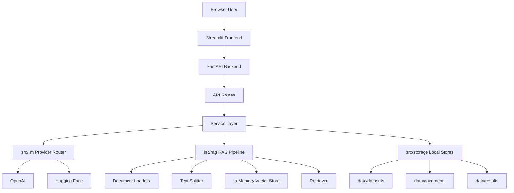
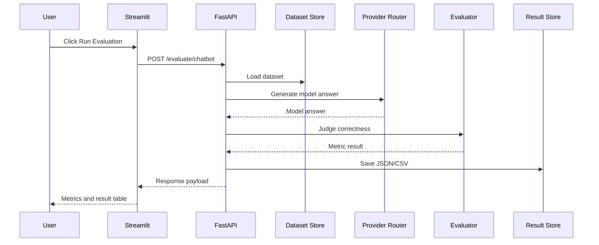
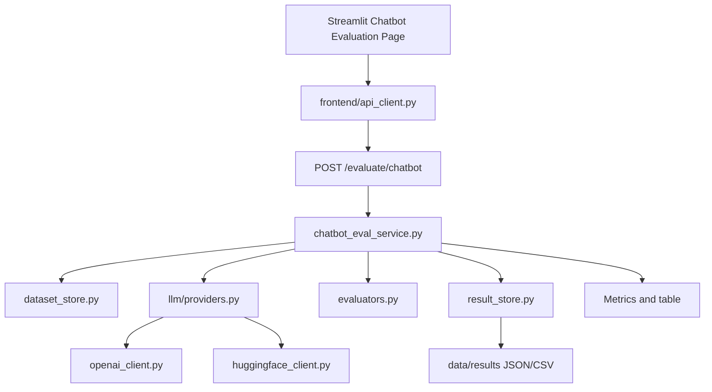
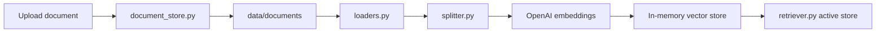
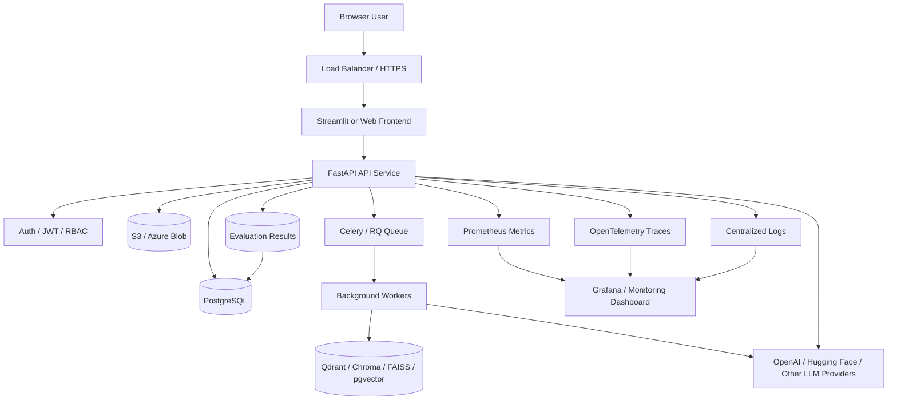

# Building a Local-First Chatbot and RAG Evaluation Platform with FastAPI, Streamlit, OpenAI, and Hugging Face

> A complete hands-on guide to building a browser-based evaluation platform for chatbot answers, RAG retrieval quality, LLM-as-judge scoring, multi-model comparison, and JSON/CSV result export.

## 1. Introduction

Large language model applications are easy to demo and hard to trust.

A chatbot may produce an answer that sounds confident, but that does not mean the answer is correct. A RAG application may produce a useful-looking answer, but that does not mean the retriever found the right documents or that the final answer was grounded in those documents.

This is why LLM applications need evaluation.

For a normal chatbot, the main question is:

```text
Did the model answer match the expected answer?
```

For a RAG system, the evaluation problem is larger:

```text
Did the retriever fetch the right context?
Did the model use that context?
Did the answer match the reference answer?
Did the answer address the user question?
```

In other words, it is not enough to ask whether the model gave an answer. We need to understand why the answer was produced and whether the supporting retrieval was useful.

This project was created to answer practical evaluation questions:

- How does a model answer compare with a reference answer?
- Is a RAG answer supported by the retrieved documents?
- Are the retrieved documents relevant to the question?
- Which model performs better on the same dataset?
- Can the whole flow run locally without depending on LangSmith?
- Can non-notebook users test this from a browser?

The project started as notebook experiments for chatbot and RAG evaluation. Over multiple phases, it evolved into a local-first FastAPI backend with a Streamlit frontend, local JSON datasets, document upload, RAG ingestion, RAG query, RAG evaluation, multi-model comparison, and JSON/CSV result export.

The final result is a small but realistic evaluation platform that a DevOps engineer, MLOps engineer, AI engineer, or backend developer can run locally and extend toward production.

## 2. What This Project Builds

This project builds a local-first Chatbot and RAG Evaluation Platform.

It includes:

- FastAPI backend
- Streamlit frontend
- Dataset Manager
- Chatbot Evaluation
- RAG Document Upload
- RAG Ingestion
- RAG Query
- RAG Evaluation
- Model Comparison
- Results Browser
- OpenAI support
- Hugging Face target model support
- JSON/CSV result export
- pytest test coverage
- local storage under `data/`
- safe `.env.example`
- hardened `.gitignore`

The platform is designed around a simple separation:

```text
Streamlit = browser UI
FastAPI = business logic
data/ = local storage
src/ = application code
tests/ = automated validation
```

Feature table:

| Feature | Purpose |
|---|---|
| Dataset Manager | Create and inspect evaluation datasets |
| Chatbot Evaluation | Compare LLM answer with reference answer |
| RAG Documents | Upload and ingest PDF/CSV/Excel/TXT/Markdown files |
| RAG Query | Ask questions from ingested documents |
| RAG Evaluation | Evaluate answer correctness, groundedness, relevance, retrieval relevance |
| Model Comparison | Compare OpenAI and Hugging Face models |
| Results Browser | View saved JSON/CSV outputs |

The application is intentionally local-first. Datasets, uploaded documents, and evaluation results are stored on disk. This makes the system easier to understand, easier to debug, and suitable for a portfolio/demo project before adding databases, authentication, background jobs, or persistent vector databases.

## 3. Core Concept: What Is Chatbot Evaluation?

Chatbot evaluation checks whether a model's answer is good enough for a known question.

A simple chatbot evaluation flow looks like this:

```text
Question
  -> Target LLM answer
  -> Reference answer
  -> Judge LLM checks correctness
  -> Local rule checks concision
  -> Result is stored
```

This project uses two main chatbot metrics:

### Correctness

Correctness checks whether the model response semantically matches the reference answer.

This is implemented with an LLM-as-judge pattern. The evaluator model receives:

- the question
- the reference answer
- the model response

It returns a boolean-style verdict:

```text
CORRECT
```

or:

```text
INCORRECT
```

### Concision

Concision checks whether the answer is short enough.

Unlike correctness, concision is not judged by an LLM. It is a simple rule:

```python
len(model_response.split()) <= threshold
```

This keeps the metric deterministic, fast, and easy to explain.

Example:

```text
Question:
What is LangChain?

Reference answer:
LangChain is a framework for building applications powered by large language models.

Model answer:
LangChain is a framework for developing LLM-powered applications.

Correctness:
True
```

The exact words are not identical, but the meaning matches. That is why the correctness evaluator should return `True`.

## 4. Core Concept: What Is RAG Evaluation?

RAG evaluation is more complex than normal chatbot evaluation because we evaluate two things:

1. Answer quality
2. Retrieval quality

A RAG system has more moving parts:

```text
Question
  -> Retriever finds document chunks
  -> LLM generates answer using retrieved context
  -> Judge compares answer with reference answer
  -> Judge checks if answer is grounded in retrieved documents
  -> Judge checks if answer is relevant to question
  -> Judge checks if retrieved chunks are relevant
```

This project evaluates RAG with four metrics.

### Correctness

Correctness asks:

```text
Does the RAG answer match the reference answer?
```

This compares the generated answer against the expected answer in the dataset.

### Groundedness

Groundedness asks:

```text
Is the answer supported by the retrieved documents?
```

This is important because a model can answer correctly from its own prior knowledge while ignoring the retrieved context. In RAG, we usually want the model answer to be supported by the source documents.

### Answer Relevance

Answer relevance asks:

```text
Does the answer address the user question?
```

An answer may be grounded in documents but still not answer the exact question.

### Retrieval Relevance

Retrieval relevance asks:

```text
Did the retriever fetch useful documents?
```

This metric evaluates the retrieval step itself. If the retriever fetches unrelated chunks, the answer generation step starts from weak context.

These four metrics help separate failure modes:

| Failure | Possible Cause |
|---|---|
| Low correctness | Model answer does not match expected answer |
| Low groundedness | Model answer is not supported by retrieved context |
| Low answer relevance | Model did not answer the user question |
| Low retrieval relevance | Retriever fetched poor context |

This is the main reason RAG evaluation is more useful than simply reading the final answer.

## 5. High-Level Architecture



The design is intentionally modular:

- Streamlit is only the frontend.
- FastAPI owns backend business logic.
- API routes receive requests and return responses.
- Services own evaluation workflows.
- `src/rag` owns RAG loading, splitting, vector storage, retrieval, and answer generation.
- `src/llm` owns provider routing, OpenAI calls, Hugging Face calls, and evaluator prompts.
- `src/storage` owns local file persistence.
- `data/` stores local datasets, uploaded documents, generated results, and vectorstore placeholders.

This separation is important because it prevents the frontend from becoming a second backend. Streamlit does not call OpenAI or Hugging Face directly. It sends API requests to FastAPI, and FastAPI owns the real work.

## 6. Request Flow: How Frontend Talks to Backend

The frontend/backend contract is simple:

```text
Streamlit builds JSON payloads.
FastAPI receives those payloads.
FastAPI validates them using Pydantic.
Services execute workflows.
Results return to Streamlit.
```

Streamlit does not call OpenAI or Hugging Face directly.

Example chatbot evaluation flow:

```text
User clicks Run Chatbot Evaluation
  -> Streamlit builds JSON payload
  -> Streamlit sends POST /evaluate/chatbot
  -> FastAPI loads dataset
  -> FastAPI calls provider router
  -> Provider router calls OpenAI or Hugging Face
  -> Evaluator checks result
  -> FastAPI saves JSON/CSV
  -> Streamlit displays table and metrics
```



This pattern is reused across chatbot evaluation, RAG query, RAG evaluation, and model comparison.

## 7. Project Folder Structure

```text
chatbot-evaluator/
  app.py
  README.md
  medium.md
  requirements.txt
  .env.example
  .gitignore
  data/
    datasets/
      chatbot_eval_sample.json
      rag_eval_sample.json
    documents/
      rag_sample.txt
    results/
      .gitkeep
    vectorstores/
      .gitkeep
  frontend/
    streamlit_app.py
    api_client.py
    components.py
  src/
    api/
      main.py
      routes/
        health.py
        datasets.py
        documents.py
        evaluation.py
        rag.py
        results.py
    core/
      config.py
    llm/
      openai_client.py
      huggingface_client.py
      providers.py
      evaluators.py
    rag/
      loaders.py
      splitter.py
      vectorstore.py
      retriever.py
      rag_chain.py
    schemas/
      common.py
      datasets.py
      documents.py
      evaluation.py
      rag.py
      results.py
    services/
      chatbot_eval_service.py
      rag_service.py
      rag_eval_service.py
      compare_eval_service.py
    storage/
      dataset_store.py
      document_store.py
      result_store.py
      paths.py
  tests/
    test_health.py
    test_dataset_api.py
    test_documents_api.py
    test_chatbot_eval_api.py
    test_rag_api.py
    test_rag_eval_api.py
    test_compare_api.py
    test_result_api.py
```

The folder structure follows a backend product style:

- `src/api`: FastAPI app and route definitions
- `src/schemas`: Pydantic request/response models
- `src/services`: workflow orchestration
- `src/llm`: model provider and evaluator logic
- `src/rag`: retrieval-augmented generation logic
- `src/storage`: local JSON/file persistence
- `frontend`: Streamlit UI and API client
- `tests`: automated test coverage

## 8. How the Backend Starts

The root `app.py` is the compatibility entry point.

It exposes the FastAPI app:

```python
from src.api.main import app
```

When you run:

```bash
uvicorn app:app --reload
```

this happens:

1. Uvicorn loads `app.py`.
2. `app.py` imports `app` from `src/api/main.py`.
3. `src/api/main.py` creates the FastAPI application.
4. `src/api/main.py` registers all API routers.

The router pattern looks like this:

```python
app.include_router(health.router)
app.include_router(datasets.router)
app.include_router(documents.router)
app.include_router(evaluation.router)
app.include_router(rag.router)
app.include_router(results.router)
```

This keeps each route group isolated:

- health routes stay in `health.py`
- dataset routes stay in `datasets.py`
- document routes stay in `documents.py`
- evaluation routes stay in `evaluation.py`
- RAG routes stay in `rag.py`
- result routes stay in `results.py`

This makes the backend easier to extend because adding a new feature usually means adding or updating one route file, one schema file, and one service file.

## 9. Backend API Routes Explained

| Endpoint | Purpose |
|---|---|
| `GET /health` | Check backend status |
| `GET /datasets` | List datasets |
| `POST /datasets` | Create/update dataset |
| `GET /datasets/{name}` | Read dataset |
| `POST /documents/upload` | Upload documents |
| `GET /documents` | List uploaded documents |
| `POST /rag/ingest` | Build vector store |
| `POST /rag/query` | Ask question from RAG |
| `POST /evaluate/chatbot` | Evaluate chatbot answers |
| `POST /evaluate/rag` | Evaluate RAG answers |
| `POST /evaluate/compare` | Compare multiple models |
| `GET /results` | List result files |
| `GET /results/{file_name}` | Read JSON/CSV result |

FastAPI also provides Swagger documentation at:

```text
http://127.0.0.1:8000/docs
```

Swagger is useful for backend-only testing without Streamlit.

## 10. Dataset Format

Datasets are stored as JSON files under:

```text
data/datasets/
```

Example:

```json
{
  "name": "chatbot_eval_sample",
  "examples": [
    {
      "inputs": {
        "question": "What is LangChain?"
      },
      "outputs": {
        "answer": "LangChain is a framework for building LLM-powered applications."
      }
    }
  ]
}
```

The important fields are:

- `inputs.question`: the user question
- `outputs.answer`: the reference answer

Both chatbot evaluation and RAG evaluation reuse this same dataset shape.

This is a useful design decision because it keeps evaluation data simple. The same dataset format can power:

- normal chatbot evaluation
- RAG evaluation
- model comparison
- future regression testing

## 11. How Dataset Manager Works

The Dataset Manager is a Streamlit page that lets users manage datasets from the browser.

The flow is:

```text
User enters question/reference answer
  -> Streamlit stores pending examples in session state
  -> User clicks Save Dataset
  -> Streamlit calls POST /datasets
  -> FastAPI saves JSON under data/datasets
```

The backend endpoint is:

```text
POST /datasets
```

The storage layer is:

```text
src/storage/dataset_store.py
```

The Streamlit page does not write files directly. It calls the FastAPI backend through:

```text
frontend/api_client.py
```

This matters because FastAPI remains the owner of validation and storage rules.

Runtime UI-created datasets are ignored by Git through `.gitignore`, while sample datasets remain trackable:

```gitignore
data/datasets/*.json
!data/datasets/chatbot_eval_sample.json
!data/datasets/rag_eval_sample.json
!data/datasets/.gitkeep
```

This keeps local experiments out of the repository while preserving clean sample data.

## 12. Chatbot Evaluation Code Flow

The chatbot evaluation flow touches these files:

```text
frontend/streamlit_app.py
frontend/api_client.py
POST /evaluate/chatbot
src/api/routes/evaluation.py
src/services/chatbot_eval_service.py
src/llm/providers.py
src/llm/openai_client.py
src/llm/huggingface_client.py
src/llm/evaluators.py
src/storage/result_store.py
```

Step-by-step:

1. Streamlit collects dataset, provider, model, evaluator, instruction, and save settings.
2. `frontend/api_client.py` sends a JSON payload to `POST /evaluate/chatbot`.
3. `src/api/routes/evaluation.py` validates the request with Pydantic.
4. `src/services/chatbot_eval_service.py` loads the dataset from local storage.
5. `src/llm/providers.py` routes the target model call to OpenAI or Hugging Face.
6. The model answer is returned to the service.
7. `src/llm/evaluators.py` uses the evaluator model to judge correctness.
8. The service checks concision using a local word-count rule.
9. `src/storage/result_store.py` saves JSON and CSV outputs when requested.
10. The API response returns to Streamlit.
11. Streamlit displays summary metrics and a result table.



This is the simplest evaluation path in the project and a good place to understand the overall architecture.

## 13. RAG Ingestion Code Flow

RAG ingestion turns local files into a searchable vector store.

The flow is:

```text
Streamlit RAG Documents page
  -> POST /documents/upload
  -> document_store.py saves files
  -> POST /rag/ingest
  -> rag_service.py
  -> loaders.py
  -> splitter.py
  -> vectorstore.py
  -> retriever.py
```

File responsibilities:

- `loaders.py`: reads TXT, Markdown, PDF, CSV, and Excel files.
- `splitter.py`: chunks documents into smaller pieces.
- `vectorstore.py`: creates embeddings and builds the in-memory vector store.
- `retriever.py`: stores the active in-memory vector store.
- `rag_service.py`: orchestrates ingestion.



The current vector store is in-memory. That means ingestion must be run again after the backend restarts.

This is acceptable for a local POC, but production should use persistent vector storage such as FAISS, Qdrant, Chroma, Weaviate, or pgvector.

## 14. RAG Query Code Flow

RAG query answers a user question using retrieved document chunks.

The flow is:

```text
Streamlit RAG Query page
  -> frontend/api_client.py
  -> POST /rag/query
  -> src/api/routes/rag.py
  -> src/services/rag_service.py
  -> src/rag/rag_chain.py
  -> src/rag/retriever.py
  -> src/llm/providers.py
  -> OpenAI or Hugging Face target model
```

The important step is context construction:

1. The retriever receives the question.
2. It returns the most relevant document chunks.
3. `rag_chain.py` formats those chunks as source context.
4. The target LLM receives the context plus the question.
5. The answer and retrieved document metadata are returned.

### Source Filtering

The project also supports document-scoped RAG filtering through:

```json
{
  "source_filter": "Security as Code.pdf"
}
```

This is useful when multiple documents are ingested but the user wants to query only one file.

If no source filter is selected, the retriever searches all ingested documents.

If a source filter is selected, the backend retrieves a larger candidate set, filters chunks whose `metadata.source` contains the selected filename, and then returns only the matching chunks.

This prevents a common RAG problem:

```text
User asks about Security as Code.pdf
Retriever returns chunks from a different PDF
Model answers using the wrong context
```

If the backend cannot find matching retrieved chunks for the selected source, it returns a clear error instead of silently answering from the wrong document.

## 15. RAG Evaluation Code Flow

RAG evaluation reuses RAG query and adds evaluator logic.

The flow is:

```text
Streamlit RAG Evaluation page
  -> POST /evaluate/rag
  -> evaluation route
  -> rag_eval_service.py
  -> rag_service.query_rag
  -> evaluators.py
  -> result_store.py
```

The four RAG metrics are implemented as judge prompts:

### Correctness

Implementation idea:

```text
question + reference answer + RAG answer -> evaluator
```

Question:

```text
Does the RAG answer semantically match the reference answer?
```

### Groundedness

Implementation idea:

```text
retrieved documents + RAG answer -> evaluator
```

Question:

```text
Is the answer supported by the retrieved documents?
```

### Answer Relevance

Implementation idea:

```text
question + RAG answer -> evaluator
```

Question:

```text
Does the answer directly address the user question?
```

### Retrieval Relevance

Implementation idea:

```text
question + retrieved documents -> evaluator
```

Question:

```text
Do the retrieved chunks contain useful information for answering the question?
```

The result is saved as a structured JSON payload and a CSV table when `save_result=true`.

## 16. Model Provider Architecture: OpenAI and Hugging Face

The project supports two target providers:

- `openai`
- `huggingface`

OpenAI is the default provider. Hugging Face is supported as an additional target model provider.

The provider router lives here:

```text
src/llm/providers.py
```

Its job is simple:

```text
if provider == "openai":
    use openai_client.py

if provider == "huggingface":
    use huggingface_client.py
```

Hugging Face uses the OpenAI-compatible API route:

```text
https://router.huggingface.co/v1
```

Current design decision:

- OpenAI remains recommended as evaluator/judge.
- Hugging Face is mainly used as a target model.
- RAG embeddings still use OpenAI embeddings.

Example payload:

```json
{
  "provider": "huggingface",
  "model_name": "Qwen/Qwen2.5-7B-Instruct",
  "evaluator_provider": "openai",
  "evaluator_model": "gpt-4o-mini"
}
```

This lets you test open-source or hosted Hugging Face models while using a stable OpenAI evaluator for scoring.

## 17. Model Comparison Flow

Model comparison supports:

- OpenAI vs OpenAI
- OpenAI vs Hugging Face
- Hugging Face vs Hugging Face

The comparison flow is:

```text
Dataset
  -> Model A evaluation
  -> Model B evaluation
  -> Summary by model
  -> Detailed result rows
  -> JSON/CSV result
```

Example RAG comparison payload:

```json
{
  "mode": "rag",
  "dataset_name": "rag_eval_sample",
  "models": [
    {
      "provider": "openai",
      "model": "gpt-4o-mini"
    },
    {
      "provider": "huggingface",
      "model": "Qwen/Qwen2.5-7B-Instruct"
    }
  ],
  "evaluator_provider": "openai",
  "evaluator_model": "gpt-4o-mini",
  "top_k": 6,
  "save_result": true
}
```

For RAG comparison, the vector store must already be initialized through `/rag/ingest`.

The comparison response includes:

- model list
- summary by model
- detailed results grouped by model
- saved JSON path
- saved CSV path

This makes it easier to compare model behavior on the same dataset.

## 18. Result Storage and Results Browser

Evaluation results are saved in:

```text
data/results/
```

When `save_result=true`, the backend saves:

- `.json`
- `.csv`

JSON is useful for full structured payloads. It preserves nested fields, model metadata, summary scores, and raw result rows.

CSV is useful for spreadsheet-style analysis. It is easier to open in Excel, Google Sheets, or BI tools.

The Results Browser page in Streamlit uses:

```text
GET /results
GET /results/{file_name}
```

It can display:

- saved result file names
- file type
- file size
- parsed JSON
- CSV rows

Runtime result files are ignored by Git because they are generated artifacts:

```gitignore
data/results/*.json
data/results/*.csv
!data/results/.gitkeep
```

This prevents local evaluation runs from polluting the repository.

## 19. Local Setup From Scratch After Cloning

Clone the repository:

```bash
git clone <your-repo-url>
cd chatbot-evaluator
```

Create a virtual environment with `uv`:

```bash
uv venv
source .venv/Scripts/activate
```

If you do not have `uv`, use Python directly:

```bash
python -m venv .venv
source .venv/Scripts/activate
pip install -r requirements.txt
```

Install dependencies with `uv`:

```bash
uv pip install -r requirements.txt
```

Create `.env` from `.env.example`:

```bash
cp .env.example .env
```

Edit `.env`:

```env
OPENAI_API_KEY=your_openai_api_key_here
HUGGINGFACE_API_KEY=your_huggingface_api_key_here
FASTAPI_BASE_URL=http://127.0.0.1:8000
```

Run the backend:

```bash
uvicorn app:app --reload
```

Run the frontend in a second terminal:

```bash
source .venv/Scripts/activate
streamlit run frontend/streamlit_app.py
```

Open:

```text
FastAPI Swagger: http://127.0.0.1:8000/docs
Streamlit UI:    http://localhost:8501
```

## 20. Backend-Only API Testing With curl

### Health

```bash
curl http://127.0.0.1:8000/health
```

### List Datasets

```bash
curl http://127.0.0.1:8000/datasets
```

### Create Dataset

```bash
curl -X POST "http://127.0.0.1:8000/datasets" \
  -H "Content-Type: application/json" \
  -d '{
    "name": "ui_dataset_manager_test",
    "examples": [
      {
        "inputs": {
          "question": "What is LangChain?"
        },
        "outputs": {
          "answer": "LangChain is a framework for building LLM-powered applications."
        }
      }
    ],
    "overwrite": true
  }'
```

### Chatbot Evaluation

```bash
curl -X POST "http://127.0.0.1:8000/evaluate/chatbot" \
  -H "Content-Type: application/json" \
  -d '{
    "dataset_name": "chatbot_eval_sample",
    "provider": "openai",
    "model_name": "gpt-4o-mini",
    "evaluator_provider": "openai",
    "evaluator_model": "gpt-4o-mini",
    "instructions": "Respond to the user question in a short, concise manner.",
    "concision_threshold": 30,
    "save_result": true
  }'
```

### Upload Document

```bash
curl -X POST "http://127.0.0.1:8000/documents/upload" \
  -F "files=@data/documents/rag_sample.txt"
```

### Ingest RAG

```bash
curl -X POST "http://127.0.0.1:8000/rag/ingest" \
  -H "Content-Type: application/json" \
  -d '{
    "source_dir": "data/documents",
    "chunk_size": 500,
    "chunk_overlap": 50,
    "embedding_model": "text-embedding-3-small"
  }'
```

### Query RAG

```bash
curl -X POST "http://127.0.0.1:8000/rag/query" \
  -H "Content-Type: application/json" \
  -d '{
    "question": "How does the ReAct agent use self-reflection?",
    "provider": "openai",
    "model_name": "gpt-4o-mini",
    "top_k": 6,
    "source_filter": null
  }'
```

### Query RAG With a Specific Source

```bash
curl -X POST "http://127.0.0.1:8000/rag/query" \
  -H "Content-Type: application/json" \
  -d '{
    "question": "Where should IaC files be stored?",
    "provider": "openai",
    "model_name": "gpt-4o-mini",
    "top_k": 6,
    "source_filter": "Security as Code.pdf"
  }'
```

### Evaluate RAG

```bash
curl -X POST "http://127.0.0.1:8000/evaluate/rag" \
  -H "Content-Type: application/json" \
  -d '{
    "dataset_name": "rag_eval_sample",
    "provider": "openai",
    "model_name": "gpt-4o-mini",
    "evaluator_provider": "openai",
    "evaluator_model": "gpt-4o-mini",
    "top_k": 6,
    "source_filter": null,
    "save_result": true
  }'
```

### Compare Models

```bash
curl -X POST "http://127.0.0.1:8000/evaluate/compare" \
  -H "Content-Type: application/json" \
  -d '{
    "mode": "rag",
    "dataset_name": "rag_eval_sample",
    "models": [
      {
        "provider": "openai",
        "model": "gpt-4o-mini"
      },
      {
        "provider": "huggingface",
        "model": "Qwen/Qwen2.5-7B-Instruct"
      }
    ],
    "evaluator_provider": "openai",
    "evaluator_model": "gpt-4o-mini",
    "top_k": 6,
    "source_filter": null,
    "save_result": true
  }'
```

### List Results

```bash
curl http://127.0.0.1:8000/results
```

## 21. End-User UI Test From Streamlit

This section is a practical manual for testing the platform from the browser.

Start both apps first:

```bash
uvicorn app:app --reload
```

In another terminal:

```bash
streamlit run frontend/streamlit_app.py
```

Open:

```text
http://localhost:8501
```

### Step 1: Home

On the Home page:

1. Confirm backend status is `ok`.
2. Check dataset count.
3. Check result file count.
4. Confirm the backend URL is correct.

If the backend is offline, start FastAPI with:

```bash
uvicorn app:app --reload
```

### Step 2: Dataset Manager

Go to Dataset Manager.

For existing datasets:

1. Click Refresh datasets.
2. Select `chatbot_eval_sample`.
3. Load the dataset.
4. Confirm questions and reference answers display.

Create a chatbot dataset:

1. Choose dataset type `chatbot`.
2. Enter dataset name `ui_chatbot_eval`.
3. Enter a question.
4. Enter a reference answer.
5. Click Add example.
6. Click Save dataset.

Create a RAG dataset:

1. Choose dataset type `rag`.
2. Enter dataset name `ui_rag_eval`.
3. Enter a question that should be answered from your uploaded document.
4. Enter the expected reference answer.
5. Click Add example.
6. Click Save dataset.

### Step 3: Chatbot Evaluation

Go to Chatbot Evaluation.

1. Select a dataset from the dropdown.
2. Choose target provider:
   - `openai`
   - `huggingface`
3. Choose or type a model name.
4. Keep evaluator provider as OpenAI.
5. Set concision threshold.
6. Click Run Chatbot Evaluation.
7. Inspect:
   - total examples
   - correctness score
   - concision score
   - model response
   - saved result path
   - saved CSV path

### Step 4: RAG Documents

Go to RAG Documents.

1. Upload a PDF, CSV, Excel, TXT, or Markdown file.
2. Click Upload documents.
3. Refresh the document list.
4. Confirm the file appears.
5. Set chunk size and chunk overlap.
6. Click Ingest documents.
7. Confirm documents loaded and chunks created.

Remember: the vector store is in-memory. Re-run ingestion after restarting FastAPI.

### Step 5: RAG Query

Go to RAG Query.

1. Enter a question.
2. Select target provider/model.
3. Set `Top K`.
4. Select target document:
   - `All documents`
   - or a specific file
5. Click Ask RAG.
6. Inspect:
   - generated answer
   - retrieved documents
   - source metadata
   - raw API response

If source filtering is used, retrieved documents should only come from the selected file.

### Step 6: RAG Evaluation

Go to RAG Evaluation.

1. Select a RAG dataset.
2. Choose provider/model.
3. Set `Top K`.
4. Select a target document if needed.
5. Click Run RAG Evaluation.
6. Inspect:
   - correctness score
   - groundedness score
   - answer relevance score
   - retrieval relevance score
   - detailed result table
   - saved JSON/CSV paths

### Step 7: Model Comparison

Go to Model Comparison.

1. Choose mode:
   - `chatbot`
   - `rag`
2. Select dataset.
3. Enter model list.

Example:

```text
openai:gpt-4o-mini,huggingface:Qwen/Qwen2.5-7B-Instruct
```

4. Keep evaluator as OpenAI.
5. For RAG mode, ingest documents first.
6. Click Compare models.
7. Inspect summary by model and detailed rows.

### Step 8: Results Browser

Go to Results Browser.

1. Click Refresh results.
2. Select a JSON result.
3. Load it.
4. Inspect summary and detailed rows.
5. Select a CSV result.
6. Load it.
7. Inspect spreadsheet-style rows.

This page is useful for reviewing previous evaluation runs without manually opening files from disk.

## 22. Testing and Validation

Run automated tests:

```bash
pytest
```

Run compile validation:

```bash
python -m compileall app.py src tests frontend
```

Test coverage includes:

- health API
- dataset API
- documents API
- chatbot evaluation API
- RAG API
- RAG evaluation API
- compare API
- results API
- provider payloads
- RAG source filtering

The tests mock OpenAI/Hugging Face-dependent paths where appropriate, so normal test runs do not require live model API calls.

At the current stage, the test suite validates the main API behavior and protects the project from breaking existing flows while adding features.

## 23. Git Hygiene and What Not to Commit

Do not commit:

```text
.env
.venv/
data/results/*.json
data/results/*.csv
data/documents/private PDFs
data/datasets/ui_*.json
data/vectorstores/*
__pycache__/
```

Why:

- `.env` has secrets.
- `.venv/` is local dependency state.
- uploaded PDFs may be private.
- result files are runtime artifacts.
- vector stores are generated.
- UI datasets are local experiments.
- Python cache files are not source code.

The repository should keep:

```text
.env.example
data/datasets/chatbot_eval_sample.json
data/datasets/rag_eval_sample.json
data/documents/rag_sample.txt
data/results/.gitkeep
data/vectorstores/.gitkeep
```

This keeps the project reproducible without leaking secrets or private documents.

## 24. Current Limitations

The project is intentionally a local-first POC. Current limitations include:

- vector store is in-memory
- re-ingest is needed after backend restart
- OpenAI embeddings are still used
- Hugging Face model availability depends on token/provider/model access
- no authentication
- no database
- no persistent vector store
- no production deployment yet
- no user/team isolation
- no background job queue for long ingestion/evaluation
- no result deletion UI
- no dataset editing/deletion API yet
- no numeric rubric scoring beyond boolean metrics

These limitations are acceptable for a learning and portfolio project, but they should be addressed before using this as a real internal platform.

## 25. Future Production-Grade Improvements

The current project is a strong foundation. To turn it into a production-grade evaluation platform, improve it across backend, RAG, evaluation, frontend, and DevOps.

### Backend

- persistent FAISS/Qdrant/Chroma vector store
- PostgreSQL for datasets/results
- object storage for documents
- async background jobs with Celery/RQ
- API auth/JWT
- RBAC
- rate limiting
- multi-tenant workspace model
- request tracing
- structured logging
- centralized error handling
- dataset update/delete APIs
- result download APIs
- dataset versioning
- audit logs for dataset and result changes

### RAG

- source filtering
- metadata filtering
- reranking
- hybrid search
- query rewriting
- chunking strategy experiments
- embedding model comparison
- grounded citation display
- document versioning
- per-document vector indexes
- better PDF parsing and table extraction
- document-specific query mode
- document collection mode
- S3 or Azure Blob document storage
- ingestion status tracking

### Evaluation

- custom evaluator templates
- rubric-based scoring
- numeric score not only boolean
- pairwise model ranking
- regression tracking across releases
- evaluation history dashboard
- evaluator calibration
- human review workflow
- confidence scoring
- failed-case clustering
- evaluation latency tracking
- evaluation cost tracking
- model release comparison
- evaluator prompt versioning

### Frontend

- better dataset editing
- update dataset examples
- delete datasets
- dataset editing and deletion
- result deletion and download buttons
- downloadable CSV/JSON
- result charts
- charts for model comparison
- evaluation history timeline
- document preview
- source citation viewer
- document-specific query mode
- admin settings page
- progress indicators for long-running jobs
- form presets for common workflows
- user/team workspace switcher

### DevOps/MLOps

- Dockerfile
- docker-compose
- CI pipeline with pytest
- linting and formatting checks
- GitHub Actions
- EC2 deployment
- Azure VM deployment
- deployment to Kubernetes
- health/readiness probes
- centralized logs
- metrics dashboard
- secrets management
- backup/restore strategy
- environment-specific config
- release rollback strategy
- artifact versioning

### Observability

- optional LangSmith integration later
- OpenTelemetry traces
- Prometheus metrics
- evaluation latency/cost tracking
- request logs with correlation IDs
- per-provider error rates
- ingestion duration metrics
- retrieval hit-rate metrics
- dashboard for evaluation trends

### Security

- never expose API keys to Streamlit/browser
- validate uploads
- scan files before ingestion
- restrict file types
- enforce max file size
- add authentication
- add authorization
- audit result access

## 26. Suggested Production Architecture

The current project is a local-first POC. It stores datasets, documents, vector state, and results locally under `data/`. That makes development simple, but a production platform needs durable storage, authentication, background processing, and observability.

A production architecture could look like this:



The production version differs from the current POC in several important ways.

| Area | Current POC | Production Direction |
|---|---|---|
| Dataset storage | JSON files under `data/datasets` | PostgreSQL with dataset versions |
| Document storage | local `data/documents` | S3 or Azure Blob |
| Vector store | in-memory | Qdrant, Chroma, FAISS, or pgvector |
| Long jobs | synchronous API calls | background workers |
| Authentication | none | JWT/OAuth/RBAC |
| Result storage | JSON/CSV files | database plus downloadable artifacts |
| Monitoring | local logs | Prometheus, OpenTelemetry, dashboards |
| Secrets | local `.env` | cloud secret manager |
| Deployment | local terminal | Docker, CI/CD, VM, or Kubernetes |

The core business workflows can stay the same:

```text
dataset -> model answer -> evaluator -> metrics -> results
```

But the infrastructure around those workflows should become more reliable, observable, and secure.

For example, document ingestion can become a background job:

```text
User uploads document
  -> API stores file in object storage
  -> API enqueues ingestion job
  -> Worker parses and chunks document
  -> Worker stores embeddings in vector DB
  -> UI shows ingestion status
```

Evaluation can follow a similar model:

```text
User starts evaluation
  -> API creates evaluation run
  -> Worker processes examples
  -> Metrics stream to database
  -> UI shows progress and final charts
```

This design avoids blocking HTTP requests during long ingestion or evaluation runs.

## 27. Conclusion

The main lesson from this project is that LLM evaluation should be treated as an application workflow, not only a notebook experiment.

Notebooks are useful for discovery, but evaluation platforms need:

- repeatable datasets
- consistent APIs
- clean storage
- UI workflows
- model comparison
- result exports
- tests
- clear architecture

This project shows how to build that foundation with FastAPI, Streamlit, OpenAI, Hugging Face, local storage, and pytest.

It shows how to move from notebook-based RAG experiments to a browser-based evaluation platform. It demonstrates local-first evaluation, supports OpenAI and Hugging Face target models, and provides a foundation for production-grade AI evaluation workflows.

It is not a finished production system yet, but it is a practical and extensible starting point for teams building internal chatbot and RAG evaluation tools.

RAG is not only about retrieving documents and generating answers. A production RAG system must also continuously evaluate whether retrieval is relevant, answers are grounded, and models are improving over time.
